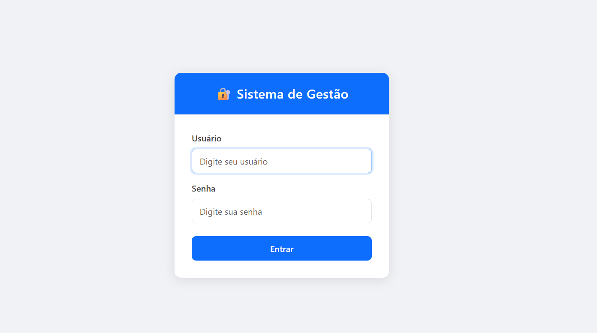
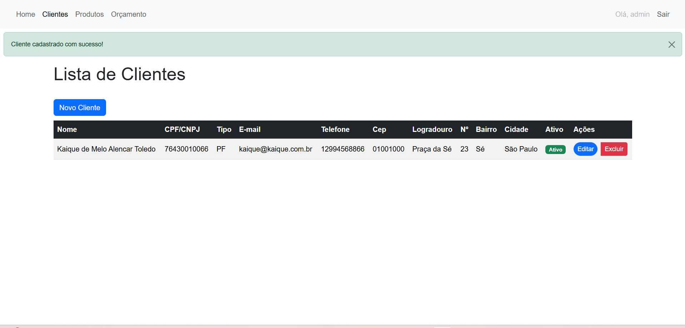
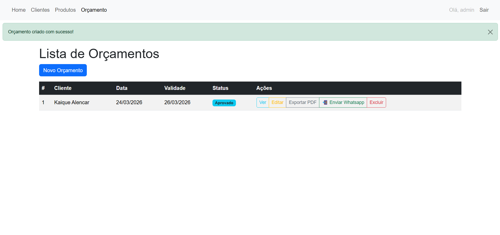
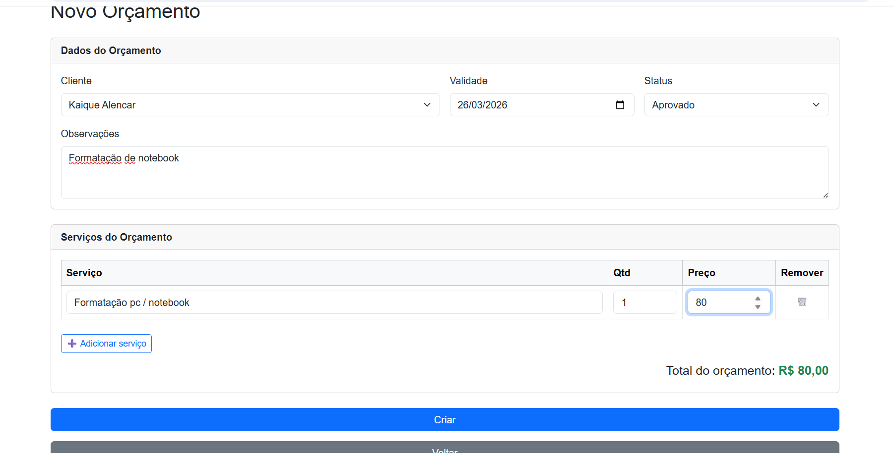
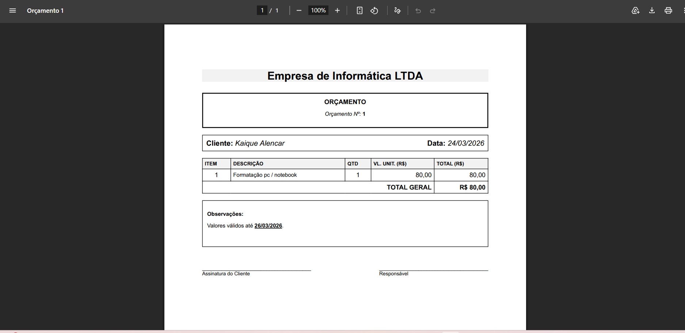

# 🗂️ Sistema de Gestão Comercial

Sistema web desenvolvido em **Django 6** para gerenciamento de clientes, serviços e orçamentos. Permite gerar orçamentos em PDF e enviá-los via WhatsApp diretamente pela plataforma.

---

## 📸 Screenshots

### Login


### Dashboard


### Lista de Clientes


### Lista de Orçamentos


### Cadastro de Orçamento


### Exportação de PDF


---

## ✅ Funcionalidades

- Autenticação de usuários com login e logout
- CRUD completo de Clientes com validação de CPF/CNPJ, telefone e CEP
- CRUD completo de Serviços
- CRUD completo de Orçamentos com itens dinâmicos e total calculado automaticamente
- Exportação de orçamento em PDF (WeasyPrint)
- Envio de orçamento via WhatsApp (integração com API via Twilio)
- Mensagens de feedback para todas as ações (sucesso e erro)
- Filtro de orçamentos por status
- Credenciais de API armazenadas com criptografia

---

## 🛠️ Tecnologias

- Python 3.14
- Django 6.0
- PostgreSQL
- Bootstrap 5
- WeasyPrint
- Twilio
- pytest + pytest-django
- python-dotenv
- cryptography

---

## 🚀 Como rodar localmente

### Pré-requisitos

- Python 3.11+
- PostgreSQL instalado e rodando
- Git

### Passo a passo

**1. Clone o repositório**
```bash
git clone https://github.com/kaiquealencar/sistema_gestao.git
cd sistema_gestao
```

**2. Crie e ative o ambiente virtual**
```bash
python -m venv .venv

# Windows
.venv\Scripts\activate

# Linux/Mac
source .venv/bin/activate
```

**3. Instale as dependências**
```bash
pip install -r requirements.txt
```

**4. Configure as variáveis de ambiente**

Copie o arquivo de exemplo e preencha com seus dados:
```bash
cp .env.example .env
```

Edite o `.env` com suas configurações:
```
SECRET_KEY=sua-secret-key-aqui
DB_NAME=sistema_gestao
DB_USER=postgres
DB_PASSWORD=sua-senha
DB_HOST=localhost
DB_PORT=5432
```

**5. Crie o banco de dados no PostgreSQL**
```bash
psql -U postgres -c "CREATE DATABASE sistema_gestao;"
```

**6. Rode as migrations**
```bash
python manage.py migrate
```

**7. Crie o superusuário**
```bash
python manage.py createsuperuser
```

**8. Inicie o servidor**
```bash
python manage.py runserver
```

Acesse: [http://127.0.0.1:8000](http://127.0.0.1:8000)

---

## 🧪 Testes

```bash
pytest
```

---

## 📁 Estrutura do Projeto

```
sistema_gestao/
├── apps/
│   ├── clientes/        # Cadastro e gestão de clientes
│   ├── servicos/        # Cadastro de serviços
│   ├── orcamentos/      # Orçamentos com itens, PDF e WhatsApp
│   ├── configuracoes/   # Configurações de API WhatsApp
│   ├── produtos/        # Cadastro de produtos
│   └── dashboard/       # Página inicial
├── core/                # Settings, URLs e WSGI
├── templates/           # Templates HTML
├── static/              # Arquivos estáticos
├── services/            # Serviços externos (WhatsApp, utils)
├── .env.example         # Modelo de variáveis de ambiente
├── requirements.txt
└── manage.py
```

---

## 📌 Funcionalidades planejadas

- Controle de permissões por tipo de usuário (Admin, Gerente, Funcionário)
- Relatórios gerenciais
- Integração com QR Code
- Deploy em servidor web

---

## 👨‍💻 Autor

**Kaique Alencar**  
[linkedin.com/in/kaiquealencar](https://linkedin.com/in/kaiquealencar) · [github.com/kaiquealencar](https://github.com/kaiquealencar)